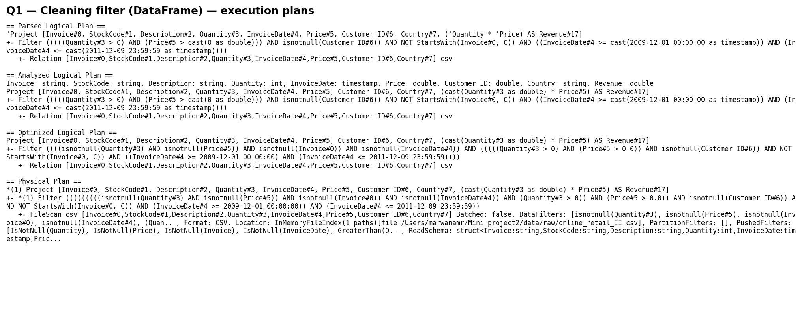
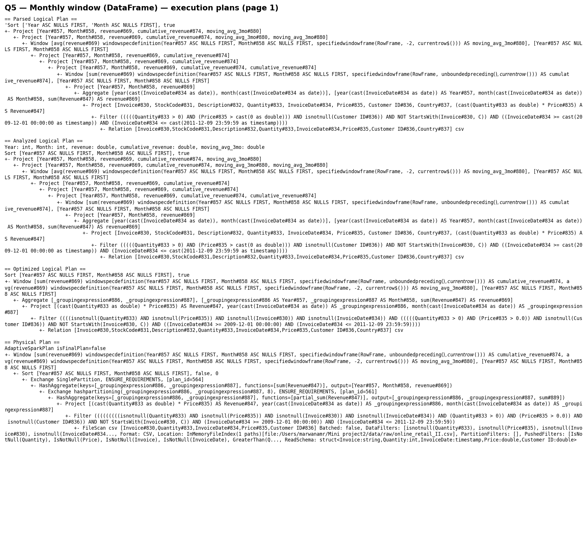
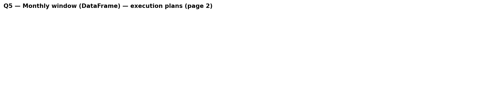
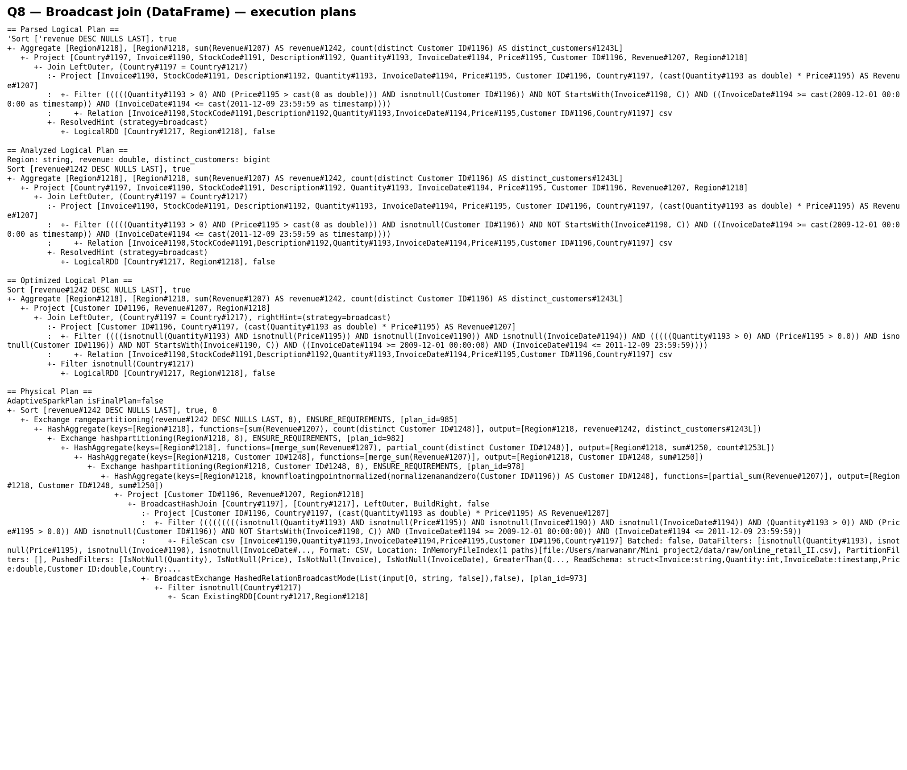
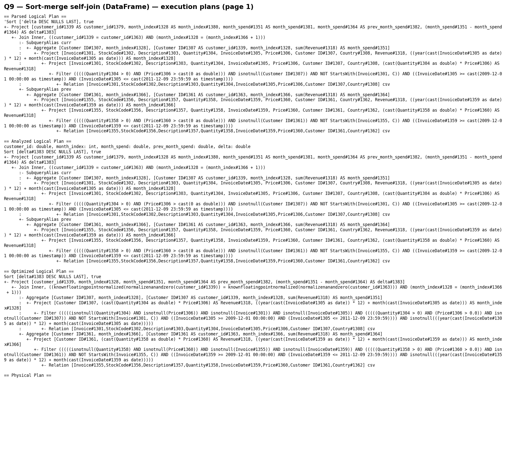
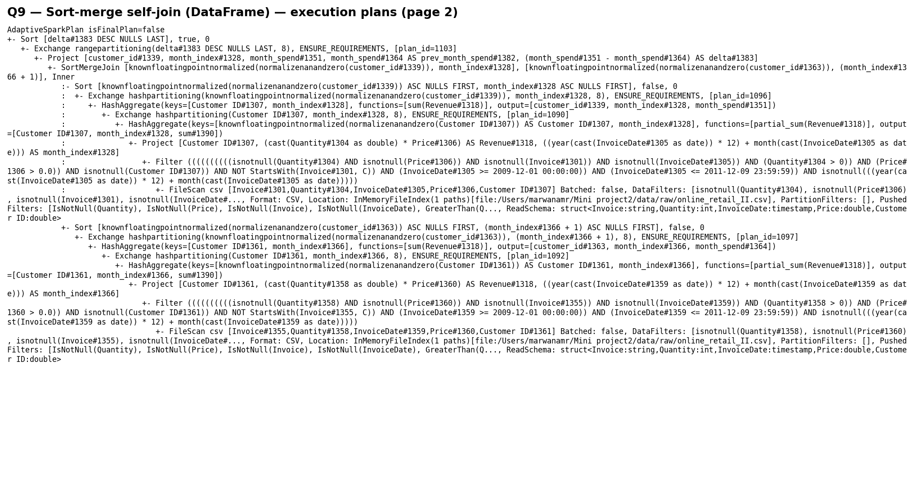
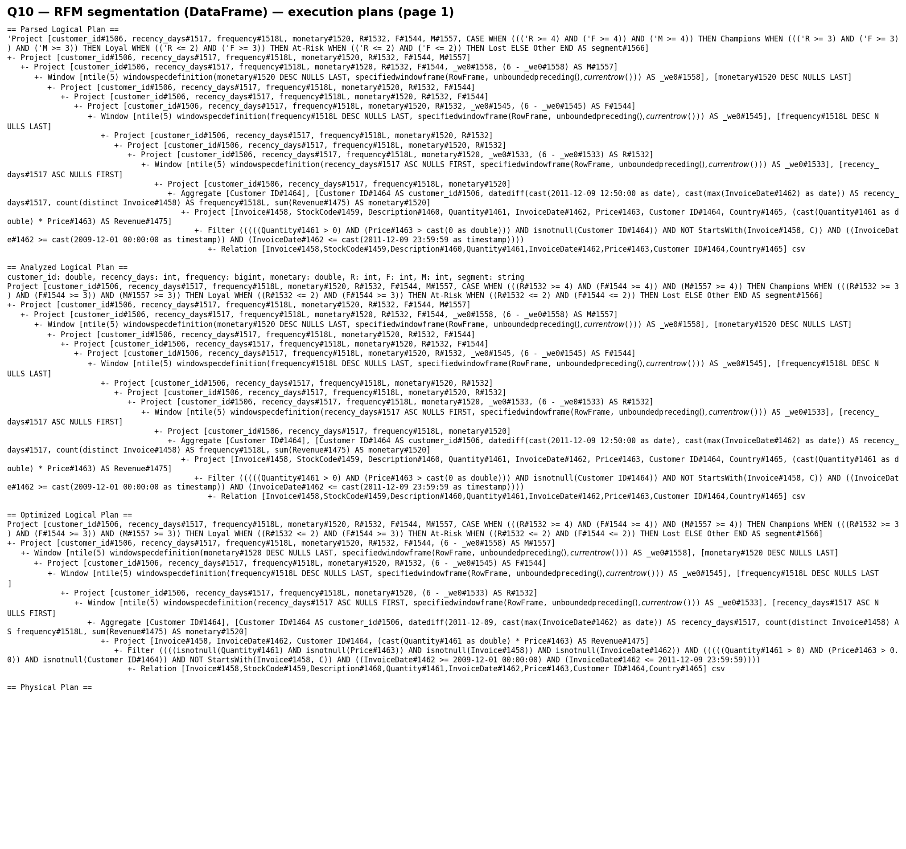
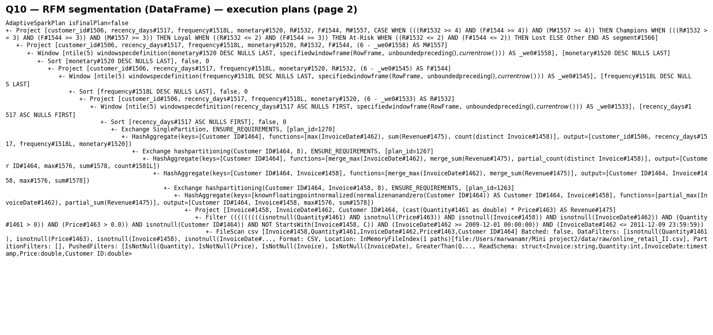
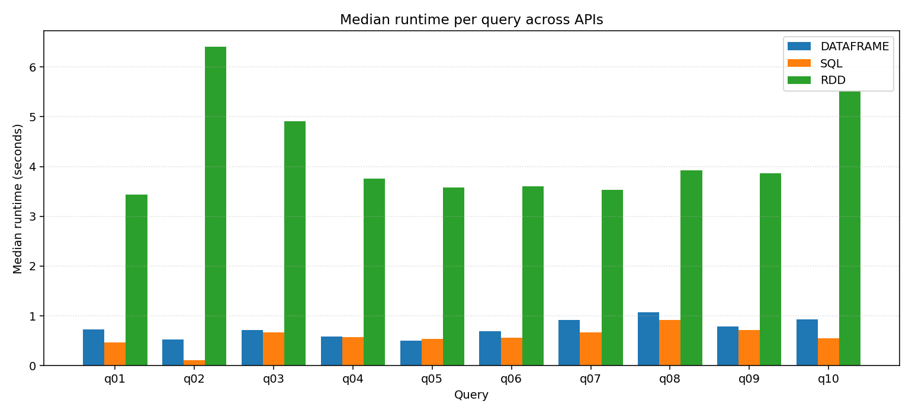
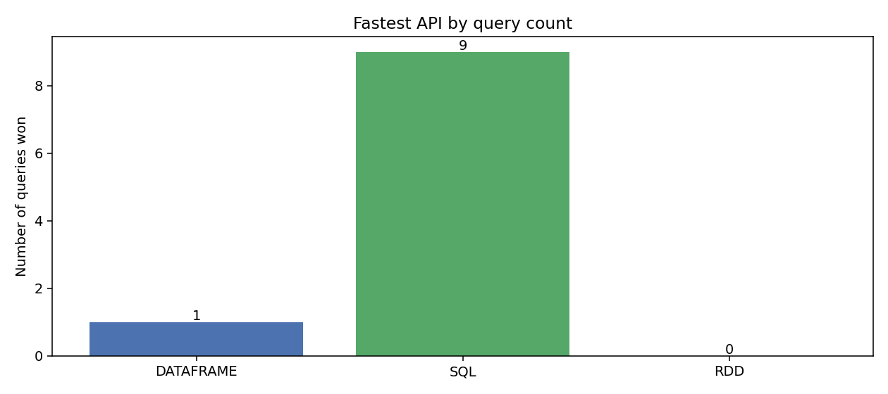

# Spark Retail Case Study — Project Report

Big Data Analytics, Mini Project 2.
Dataset: Online Retail II (UCI ML Repository).
APIs compared: RDD, DataFrame, Spark SQL.

---

## 1. Problem Statement

We use the Online Retail II dataset to answer one combined question:

> Which customer segments drive revenue, and how do their purchasing patterns evolve over time and across countries?

Answering this needs both customer-level and time-level work. We do customer segmentation with the RFM method (Recency, Frequency, Monetary value) and look at sales trends by month and country. The combined workload involves per-customer aggregates, time-windowed aggregates, and joins between them — that is the kind of work Spark is built for.

---

## 2. Dataset Description

| Property | Value |
|---|---|
| Source | UCI ML Repository, *Online Retail II* |
| File | `data/raw/online_retail_II.csv` |
| Rows | 1,067,372 |
| Columns | 8 |
| Size | ~95 MB on disk |
| Date range | 2009-12-01 to 2011-12-09 |

Schema:

| Column | Type | Notes |
|---|---|---|
| Invoice | string | invoice number; values starting with 'C' are cancellations |
| StockCode | string | product code |
| Description | string | product name |
| Quantity | int | negative for returns |
| InvoiceDate | timestamp | yyyy-MM-dd HH:mm:ss |
| Price | double | unit price in GBP |
| Customer ID | double (nullable) | anonymized customer ID |
| Country | string | ~40 distinct values |

After Q1 cleaning the dataset has 805,549 rows. From those rows Q2 reports total revenue £17,743,429, 36,969 invoices, 5,878 customers, and an average order value of £479.95.

The dataset meets all of the rubric's size and shape requirements (over 1M rows, 8 columns, mixed numeric / string / timestamp / categorical types). At ~95 MB it fits in memory on a laptop, but the workload itself — high-cardinality group-bys, window functions, joins on 800K-row aggregates — is the kind of pattern that scales the same way on a real cluster. Section 5.2 confirms that empirically by varying the local parallelism.

---

## 3. Queries Implemented

The 10 queries cover every category required by the rubric.

| # | Query | Rubric requirement |
|---|---|---|
| Q1 | Cleaning filter | (1) complex filter |
| Q2 | Top-line aggregates (SUM, AVG, COUNT, MIN, MAX) | (2) basic aggregates |
| Q3 | Revenue by Country × Year × Month | (3) group by multiple attributes |
| Q4 | Top-10 products by revenue | (4) sort & rank |
| Q5 | Monthly cumulative revenue + 3-month moving average | (5) window |
| Q6 | Top-5 customers per country (ROW_NUMBER) | (5) window |
| Q7 | Above-average customers (scalar subquery) | (6) subquery |
| Q8 | Country → Region join, broadcast hint | (7) broadcast join |
| Q9 | Customer × month self-join, sort-merge | (7) sort-merge join |
| Q10 | RFM segmentation with NTILE(5) | (5) window |

We verified that the three implementations of each query produce the same row count by cross-checking [outputs/metrics/performance.csv](outputs/metrics/performance.csv).

The rest of this section lists the core code for each query in all three APIs. The full source files (with imports, SparkSession setup, and main blocks) are under [src/rdd/](src/rdd/), [src/dataframe/](src/dataframe/), and [src/sql/](src/sql/).

### Q1 — Cleaning filter

**SQL** ([src/sql/q01_filter.py](src/sql/q01_filter.py)):

```sql
SELECT *, Quantity * Price AS Revenue
FROM raw
WHERE Quantity > 0
  AND Price > 0
  AND `Customer ID` IS NOT NULL
  AND Invoice NOT LIKE 'C%'
  AND InvoiceDate BETWEEN TIMESTAMP'2009-12-01 00:00:00'
                      AND TIMESTAMP'2011-12-09 23:59:59'
```

**DataFrame** ([src/dataframe/q01_filter.py](src/dataframe/q01_filter.py)):

```python
cleaned = df.filter(
    (F.col("Quantity") > 0)
    & (F.col("Price") > 0)
    & F.col("`Customer ID`").isNotNull()
    & ~F.col("Invoice").startswith("C")
    & F.col("InvoiceDate").between(
        "2009-12-01 00:00:00", "2011-12-09 23:59:59"
    )
).withColumn("Revenue", F.col("Quantity") * F.col("Price"))
```

**RDD** ([src/rdd/q01_filter.py](src/rdd/q01_filter.py)):

```python
def _is_clean(s):
    return (
        s is not None
        and s.quantity > 0
        and s.price > 0
        and not s.invoice.startswith("C")
        and MIN_DATE <= s.invoice_date <= MAX_DATE
    )

raw = sc.textFile(RAW_CSV_PATH)
header = raw.first()
sales = raw.filter(lambda r: r != header).map(_parse_line).filter(_is_clean)
```

The RDD form has to parse CSV by hand (we use Python's `csv` module so quoted fields with commas are handled), build a typed `Sale` namedtuple, and filter row by row. The DataFrame and SQL forms get all of that for free from the CSV reader.

### Q2 — Top-line aggregates

**SQL** ([src/sql/q02_aggregates.py](src/sql/q02_aggregates.py)):

```sql
WITH invoice_totals AS (
    SELECT Invoice, SUM(Revenue) AS invoice_total
    FROM sales
    GROUP BY Invoice
)
SELECT
    (SELECT SUM(Revenue) FROM sales)                  AS total_revenue,
    (SELECT COUNT(DISTINCT Invoice) FROM sales)       AS distinct_invoices,
    (SELECT COUNT(DISTINCT `Customer ID`) FROM sales) AS distinct_customers,
    (SELECT MAX(Revenue) FROM sales)                  AS max_line_revenue,
    (SELECT MIN(InvoiceDate) FROM sales)              AS min_invoice_date,
    (SELECT MAX(InvoiceDate) FROM sales)              AS max_invoice_date,
    (SELECT AVG(invoice_total) FROM invoice_totals)   AS avg_order_value
```

**DataFrame** ([src/dataframe/q02_aggregates.py](src/dataframe/q02_aggregates.py)):

```python
df = cleaned_dataframe(spark)
invoice_totals = df.groupBy("Invoice").agg(
    F.sum("Revenue").alias("invoice_total")
)
avg_order_value = invoice_totals.agg(
    F.avg("invoice_total").alias("avg_order_value")
)
summary = df.agg(
    F.sum("Revenue").alias("total_revenue"),
    F.countDistinct("Invoice").alias("distinct_invoices"),
    F.countDistinct("`Customer ID`").alias("distinct_customers"),
    F.max("Revenue").alias("max_line_revenue"),
    F.min("InvoiceDate").alias("min_invoice_date"),
    F.max("InvoiceDate").alias("max_invoice_date"),
)
return summary.crossJoin(avg_order_value)
```

**RDD** ([src/rdd/q02_aggregates.py](src/rdd/q02_aggregates.py)):

```python
sales = load_clean_sales(sc).cache()
total_revenue = sales.map(lambda s: s.revenue).sum()
distinct_invoices = sales.map(lambda s: s.invoice).distinct().count()
distinct_customers = sales.map(lambda s: s.customer_id).distinct().count()
max_line_revenue = sales.map(lambda s: s.revenue).max()
min_invoice_date = sales.map(lambda s: s.invoice_date).min()
max_invoice_date = sales.map(lambda s: s.invoice_date).max()
invoice_totals = (
    sales.map(lambda s: (s.invoice, s.revenue))
    .reduceByKey(lambda a, b: a + b)
)
total = invoice_totals.map(lambda kv: kv[1]).sum()
n = invoice_totals.count()
avg_order_value = total / n
```

The RDD form runs each aggregate as a separate job. The DataFrame and SQL forms compute them in one fused pass.

### Q3 — Revenue by Country × Year × Month

**SQL** ([src/sql/q03_revenue_by_country_year_month.py](src/sql/q03_revenue_by_country_year_month.py)):

```sql
SELECT
    Country,
    year(InvoiceDate)  AS Year,
    month(InvoiceDate) AS Month,
    SUM(Revenue)            AS revenue,
    COUNT(DISTINCT Invoice) AS order_count
FROM sales
GROUP BY Country, year(InvoiceDate), month(InvoiceDate)
ORDER BY revenue DESC
```

**DataFrame** ([src/dataframe/q03_revenue_by_country_year_month.py](src/dataframe/q03_revenue_by_country_year_month.py)):

```python
return (
    df.withColumn("Year", F.year("InvoiceDate"))
    .withColumn("Month", F.month("InvoiceDate"))
    .groupBy("Country", "Year", "Month")
    .agg(
        F.sum("Revenue").alias("revenue"),
        F.countDistinct("Invoice").alias("order_count"),
    )
    .orderBy(F.desc("revenue"))
)
```

**RDD** ([src/rdd/q03_revenue_by_country_year_month.py](src/rdd/q03_revenue_by_country_year_month.py)):

```python
return (
    sales.map(lambda s: (
        (s.country, s.invoice_date.year, s.invoice_date.month),
        (s.revenue, s.invoice),
    ))
    .aggregateByKey(
        (0.0, set()),
        lambda acc, val: (acc[0] + val[0], acc[1] | {val[1]}),
        lambda a, b: (a[0] + b[0], a[1] | b[1]),
    )
    .map(lambda kv: (kv[0], kv[1][0], len(kv[1][1])))
    .sortBy(lambda x: -x[1])
)
```

### Q4 — Top-10 products by revenue

**SQL** ([src/sql/q04_top_products.py](src/sql/q04_top_products.py)):

```sql
SELECT StockCode, Description,
       SUM(Revenue)  AS revenue,
       SUM(Quantity) AS units_sold
FROM sales
GROUP BY StockCode, Description
ORDER BY revenue DESC
LIMIT 10
```

**DataFrame** ([src/dataframe/q04_top_products.py](src/dataframe/q04_top_products.py)):

```python
return (
    df.groupBy("StockCode", "Description")
    .agg(
        F.sum("Revenue").alias("revenue"),
        F.sum("Quantity").alias("units_sold"),
    )
    .orderBy(F.desc("revenue"))
    .limit(10)
)
```

**RDD** ([src/rdd/q04_top_products.py](src/rdd/q04_top_products.py)):

```python
revenue = sales.map(
    lambda s: ((s.stock_code, s.description), s.revenue)
).reduceByKey(add)
units = sales.map(
    lambda s: ((s.stock_code, s.description), s.quantity)
).reduceByKey(add)
return (
    revenue.join(units)
    .map(lambda kv: (kv[0][0], kv[0][1], kv[1][0], kv[1][1]))
    .takeOrdered(10, key=lambda r: -r[2])
)
```

### Q5 — Monthly cumulative + moving average

**SQL** ([src/sql/q05_monthly_trend.py](src/sql/q05_monthly_trend.py)):

```sql
WITH monthly AS (
    SELECT year(InvoiceDate)  AS Year,
           month(InvoiceDate) AS Month,
           SUM(Revenue)       AS revenue
    FROM sales
    GROUP BY year(InvoiceDate), month(InvoiceDate)
)
SELECT Year, Month, revenue,
       SUM(revenue) OVER (ORDER BY Year, Month
            ROWS BETWEEN UNBOUNDED PRECEDING AND CURRENT ROW)
            AS cumulative_revenue,
       AVG(revenue) OVER (ORDER BY Year, Month
            ROWS BETWEEN 2 PRECEDING AND CURRENT ROW)
            AS moving_avg_3mo
FROM monthly
ORDER BY Year, Month
```

**DataFrame** ([src/dataframe/q05_monthly_trend.py](src/dataframe/q05_monthly_trend.py)):

```python
monthly = df.groupBy(
    F.year("InvoiceDate").alias("Year"),
    F.month("InvoiceDate").alias("Month"),
).agg(F.sum("Revenue").alias("revenue"))

w_cum = (Window.orderBy("Year", "Month")
              .rowsBetween(Window.unboundedPreceding, Window.currentRow))
w_mov = Window.orderBy("Year", "Month").rowsBetween(-2, 0)
return (monthly
    .withColumn("cumulative_revenue", F.sum("revenue").over(w_cum))
    .withColumn("moving_avg_3mo", F.avg("revenue").over(w_mov))
    .orderBy("Year", "Month"))
```

**RDD** ([src/rdd/q05_monthly_trend.py](src/rdd/q05_monthly_trend.py)):

```python
monthly = (sales
    .map(lambda s: ((s.invoice_date.year, s.invoice_date.month), s.revenue))
    .reduceByKey(add)
    .sortByKey()
    .collect())

cumulative = 0.0
out = []
for i, ((y, m), rev) in enumerate(monthly):
    cumulative += rev
    window_slice = [r for _, r in monthly[max(0, i - 2): i + 1]]
    moving_avg = sum(window_slice) / len(window_slice)
    out.append((y, m, rev, cumulative, moving_avg))
return sc.parallelize(out)
```

There is no native window function in the RDD API, so we collect the ~25 monthly aggregates to the driver, run a Python loop, and parallelize the result back. The DataFrame `Window` form replaces the loop with a declarative spec that Catalyst turns into a single sorted scan.

### Q6 — Top-5 customers per country

**SQL** ([src/sql/q06_customer_rank_by_country.py](src/sql/q06_customer_rank_by_country.py)):

```sql
WITH customer_totals AS (
    SELECT Country, `Customer ID` AS customer_id, SUM(Revenue) AS total_spend
    FROM sales
    GROUP BY Country, `Customer ID`
),
ranked AS (
    SELECT *,
           ROW_NUMBER() OVER (
               PARTITION BY Country ORDER BY total_spend DESC
           ) AS rank_in_country
    FROM customer_totals
)
SELECT * FROM ranked
WHERE rank_in_country <= 5
ORDER BY Country, rank_in_country
```

**DataFrame** ([src/dataframe/q06_customer_rank_by_country.py](src/dataframe/q06_customer_rank_by_country.py)):

```python
customer_totals = df.groupBy("Country", "`Customer ID`").agg(
    F.sum("Revenue").alias("total_spend")
)
w = Window.partitionBy("Country").orderBy(F.desc("total_spend"))
return (customer_totals
    .withColumn("rank_in_country", F.row_number().over(w))
    .filter(F.col("rank_in_country") <= 5)
    .orderBy("Country", "rank_in_country"))
```

**RDD** ([src/rdd/q06_customer_rank_by_country.py](src/rdd/q06_customer_rank_by_country.py)):

```python
per_customer = sales.map(
    lambda s: ((s.country, s.customer_id), s.revenue)
).reduceByKey(add)
keyed = per_customer.map(lambda kv: (kv[0][0], (kv[0][1], kv[1])))
grouped = keyed.groupByKey()

def top5(values):
    return sorted(values, key=lambda cv: -cv[1])[:5]

return grouped.flatMapValues(top5).map(
    lambda kv: (kv[0], kv[1][0], kv[1][1])
)
```

### Q7 — Above-average customers

**SQL** ([src/sql/q07_above_average_customers.py](src/sql/q07_above_average_customers.py)):

```sql
WITH customer_totals AS (
    SELECT `Customer ID` AS customer_id, SUM(Revenue) AS total_spend
    FROM sales
    GROUP BY `Customer ID`
)
SELECT customer_id, total_spend,
       (SELECT AVG(total_spend) FROM customer_totals) AS avg_spend_baseline
FROM customer_totals
WHERE total_spend > (SELECT AVG(total_spend) FROM customer_totals)
ORDER BY total_spend DESC
```

**DataFrame** ([src/dataframe/q07_above_average_customers.py](src/dataframe/q07_above_average_customers.py)):

```python
customer_totals = df.groupBy("`Customer ID`").agg(
    F.sum("Revenue").alias("total_spend")
)
avg_spend = float(
    customer_totals.agg(F.avg("total_spend").alias("avg")).collect()[0]["avg"]
)
return (customer_totals
    .filter(F.col("total_spend") > F.lit(avg_spend))
    .orderBy(F.desc("total_spend"))
    .withColumn("avg_spend_baseline", F.lit(avg_spend)))
```

**RDD** ([src/rdd/q07_above_average_customers.py](src/rdd/q07_above_average_customers.py)):

```python
customer_totals = sales.map(
    lambda s: (s.customer_id, s.revenue)
).reduceByKey(add).cache()
total, count = customer_totals.map(lambda kv: (kv[1], 1)).reduce(
    lambda a, b: (a[0] + b[0], a[1] + b[1])
)
avg_spend = total / count
bcast = sc.broadcast(avg_spend)
return customer_totals.filter(lambda kv: kv[1] > bcast.value).map(
    lambda kv: (kv[0], kv[1], bcast.value)
)
```

### Q8 — Broadcast join

**SQL** ([src/sql/q08_broadcast_join.py](src/sql/q08_broadcast_join.py)):

```sql
SELECT /*+ BROADCAST(country_region) */
    country_region.Region                AS Region,
    SUM(sales.Revenue)                   AS revenue,
    COUNT(DISTINCT sales.`Customer ID`)  AS distinct_customers
FROM sales
LEFT JOIN country_region
  ON sales.Country = country_region.Country
GROUP BY country_region.Region
ORDER BY revenue DESC
```

**DataFrame** ([src/dataframe/q08_broadcast_join.py](src/dataframe/q08_broadcast_join.py)):

```python
sales = cleaned_dataframe(spark)
region_df = build_region_df(spark)  # ~40 rows (Country, Region)
return (sales
    .join(broadcast(region_df), on="Country", how="left")
    .groupBy("Region")
    .agg(
        F.sum("Revenue").alias("revenue"),
        F.countDistinct("`Customer ID`").alias("distinct_customers"),
    )
    .orderBy(F.desc("revenue")))
```

**RDD** ([src/rdd/q08_broadcast_join.py](src/rdd/q08_broadcast_join.py)):

```python
region_map = dict(country_region_pairs())
bcast = sc.broadcast(region_map)
keyed = sales.map(lambda s: (
    bcast.value.get(s.country, "Unknown"),
    (s.revenue, s.customer_id)
))
revenue_by_region = keyed.map(
    lambda kv: (kv[0], kv[1][0])
).reduceByKey(add)
customers_by_region = (
    keyed.map(lambda kv: ((kv[0], kv[1][1]), 1))
    .reduceByKey(add)
    .map(lambda kv: (kv[0][0], 1))
    .reduceByKey(add)
)
return (revenue_by_region.join(customers_by_region)
    .map(lambda kv: (kv[0], kv[1][0], kv[1][1]))
    .sortBy(lambda r: -r[1]))
```

### Q9 — Sort-merge self-join

**SQL** ([src/sql/q09_sort_merge_self_join.py](src/sql/q09_sort_merge_self_join.py)):

```sql
-- spark.sql.autoBroadcastJoinThreshold = -1 to force SortMergeJoin
CREATE OR REPLACE TEMP VIEW monthly AS
SELECT `Customer ID` AS customer_id,
       year(InvoiceDate)*12 + month(InvoiceDate) AS month_index,
       SUM(Revenue) AS month_spend
FROM sales
GROUP BY `Customer ID`, year(InvoiceDate)*12 + month(InvoiceDate);

SELECT curr.customer_id,
       curr.month_index,
       curr.month_spend,
       prev.month_spend AS prev_month_spend,
       (curr.month_spend - prev.month_spend) AS delta
FROM monthly curr
JOIN monthly prev
  ON curr.customer_id = prev.customer_id
 AND curr.month_index = prev.month_index + 1
ORDER BY delta DESC
```

**DataFrame** ([src/dataframe/q09_sort_merge_self_join.py](src/dataframe/q09_sort_merge_self_join.py)):

```python
df = cleaned_dataframe(spark).withColumn(
    "month_index",
    F.year("InvoiceDate") * F.lit(12) + F.month("InvoiceDate"),
)
monthly = df.groupBy(
    F.col("`Customer ID`").alias("customer_id"), "month_index"
).agg(F.sum("Revenue").alias("month_spend"))

spark.conf.set("spark.sql.autoBroadcastJoinThreshold", "-1")
prev = monthly.alias("prev")
curr = monthly.alias("curr")
joined = curr.join(prev,
    (F.col("curr.customer_id") == F.col("prev.customer_id"))
    & (F.col("curr.month_index") == F.col("prev.month_index") + F.lit(1)),
    how="inner",
)
return joined.select(
    F.col("curr.customer_id").alias("customer_id"),
    F.col("curr.month_index").alias("month_index"),
    F.col("curr.month_spend").alias("month_spend"),
    F.col("prev.month_spend").alias("prev_month_spend"),
    (F.col("curr.month_spend") - F.col("prev.month_spend")).alias("delta"),
).orderBy(F.desc("delta"))
```

**RDD** ([src/rdd/q09_sort_merge_self_join.py](src/rdd/q09_sort_merge_self_join.py)):

```python
monthly = (sales
    .map(lambda s: (
        (s.customer_id, s.invoice_date.year * 12 + s.invoice_date.month),
        s.revenue,
    ))
    .reduceByKey(add)
    .cache())

curr = monthly.map(lambda kv: ((kv[0][0], kv[0][1]), kv[1]))
prev = monthly.map(lambda kv: ((kv[0][0], kv[0][1] + 1), kv[1]))
joined = curr.join(prev)
return joined.map(lambda kv: (
    kv[0][0],            # customer_id
    kv[0][1],            # month_index
    kv[1][0],            # curr_spend
    kv[1][1],            # prev_spend
    kv[1][0] - kv[1][1], # delta
)).sortBy(lambda r: -r[4])
```

### Q10 — RFM segmentation

**SQL** ([src/sql/q10_rfm_segmentation.py](src/sql/q10_rfm_segmentation.py)):

```sql
CREATE OR REPLACE TEMP VIEW rfm_raw AS
SELECT `Customer ID` AS customer_id,
       DATEDIFF((SELECT MAX(InvoiceDate) FROM sales), MAX(InvoiceDate))
                                  AS recency_days,
       COUNT(DISTINCT Invoice)    AS frequency,
       SUM(Revenue)               AS monetary
FROM sales
GROUP BY `Customer ID`;

WITH scored AS (
    SELECT customer_id, recency_days, frequency, monetary,
           6 - NTILE(5) OVER (ORDER BY recency_days ASC) AS R,
           6 - NTILE(5) OVER (ORDER BY frequency  DESC) AS F,
           6 - NTILE(5) OVER (ORDER BY monetary   DESC) AS M
    FROM rfm_raw
)
SELECT customer_id, recency_days, frequency, monetary, R, F, M,
       CASE
           WHEN R >= 4 AND F >= 4 AND M >= 4 THEN 'Champions'
           WHEN R >= 3 AND F >= 3 AND M >= 3 THEN 'Loyal'
           WHEN R <= 2 AND F >= 3            THEN 'At-Risk'
           WHEN R <= 2 AND F <= 2            THEN 'Lost'
           ELSE 'Other'
       END AS segment
FROM scored
```

**DataFrame** ([src/dataframe/q10_rfm_segmentation.py](src/dataframe/q10_rfm_segmentation.py)):

```python
df = cleaned_dataframe(spark)
ref_date = df.agg(F.max("InvoiceDate").alias("ref")).collect()[0]["ref"]
rfm = df.groupBy(F.col("`Customer ID`").alias("customer_id")).agg(
    F.datediff(F.lit(ref_date), F.max("InvoiceDate")).alias("recency_days"),
    F.countDistinct("Invoice").alias("frequency"),
    F.sum("Revenue").alias("monetary"),
)
w_r = Window.orderBy(F.col("recency_days").asc())
w_f = Window.orderBy(F.col("frequency").desc())
w_m = Window.orderBy(F.col("monetary").desc())
scored = (rfm
    .withColumn("R", F.lit(6) - F.ntile(5).over(w_r))
    .withColumn("F", F.lit(6) - F.ntile(5).over(w_f))
    .withColumn("M", F.lit(6) - F.ntile(5).over(w_m)))
return scored.withColumn("segment", _segment_expr())
```

**RDD** ([src/rdd/q10_rfm_segmentation.py](src/rdd/q10_rfm_segmentation.py)):

```python
ref_date = sales.map(lambda s: s.invoice_date).max()
rfm = (sales
    .map(lambda s: (s.customer_id, (s.invoice_date, s.invoice, s.revenue)))
    .groupByKey()
    .mapValues(lambda triples: {
        "recency_days": (ref_date - max(t[0] for t in triples)).days,
        "frequency": len({t[1] for t in triples}),
        "monetary": sum(t[2] for t in triples),
    })
    .map(lambda kv: {
        "customer_id": kv[0], **kv[1],
    })
    .collect())
# Quintile assignment runs in the driver: sort by each axis, bucket by index.
r_score = _quintile_assign(rfm, "recency_days", descending=False)
f_score = _quintile_assign(rfm, "frequency", descending=True)
m_score = _quintile_assign(rfm, "monetary", descending=True)
rows = [
    (v["customer_id"], v["recency_days"], v["frequency"], v["monetary"],
     r_score[v["customer_id"]], f_score[v["customer_id"]], m_score[v["customer_id"]],
     _segment(...))
    for v in rfm
]
return sc.parallelize(rows)
```

There is no NTILE in the RDD API, so the RDD form sorts the customer list three times in the driver and assigns quintile buckets by index.

---

## 4. Execution Plan Comparison

For every DataFrame and SQL query, Spark produces four plans:

1. **Parsed Logical Plan** — what the user wrote.
2. **Analyzed Logical Plan** — column references resolved.
3. **Optimized Logical Plan** — Catalyst rewrites (predicate pushdown, projection pruning, constant folding, reorderings).
4. **Physical Plan** — execution strategy (`FileScan`, `Exchange`, `HashAggregate`, `BroadcastHashJoin`, `SortMergeJoin`, …).

All 30 plan files (10 queries × 3 APIs) are in [outputs/explain/](outputs/explain/). For RDDs there is no Catalyst plan; we capture lineage via `rdd.toDebugString()` instead.

The five sub-sections below show the captured plans for the headline queries as screenshots.

### 4.1 Q1 — Predicate pushdown

Plan file: [outputs/explain/q01_dataframe.txt](outputs/explain/q01_dataframe.txt).



The Optimized Logical Plan adds `isnotnull(...)` checks before each user filter so the comparable predicates can be pushed further. The Physical Plan ends with a `FileScan csv` whose `PushedFilters` list contains those null checks plus `Quantity > 0`, `Price > 0`, etc. The CSV reader applies them line by line. The date range and the `StartsWith('C')` predicates stay at the `Filter` operator above the scan because the CSV format does not support them natively. Re-running the same query against the partitioned Parquet copy (§5.2) lets Catalyst push more.

The RDD version receives none of this. Every record is parsed and filtered in Python.

### 4.2 Q5 — Window function

Plan file: [outputs/explain/q05_dataframe.txt](outputs/explain/q05_dataframe.txt).





The physical plan has a single `Window` operator preceded by a `Sort` and an `Exchange SinglePartition`. There is no partition key in the window spec, so Spark coalesces the whole frame into one partition and computes the cumulative sum and moving average in one pass over the sorted stream. The RDD form ends in a `parallelize` of pre-computed rows because the cumulative sum was computed in the driver after a `collect`.

### 4.3 Q8 — Broadcast join

Plan file: [outputs/explain/q08_dataframe.txt](outputs/explain/q08_dataframe.txt).



The join node is a `BroadcastHashJoin` with `BuildRight`. Spark ships the small `country_region` table (~40 rows) to every executor as a hash map. Beneath the right side is a `BroadcastExchange HashedRelationBroadcastMode(...)` operator wrapping the in-memory region scan. The large sales side is not shuffled at all.

### 4.4 Q9 — Sort-merge join

Plan file: [outputs/explain/q09_dataframe.txt](outputs/explain/q09_dataframe.txt).





The join node is a `SortMergeJoin` over `(customer_id, month_index)` on one side and `(customer_id, month_index + 1)` on the other. Beneath each side, Catalyst inserts an `Exchange hashpartitioning(...)` to co-locate matching keys, followed by a `Sort` on the join keys. The merge step then walks both sides in lock-step. The query disables auto-broadcast (`spark.sql.autoBroadcastJoinThreshold = -1`) to force this plan; without that override Catalyst would have considered a broadcast strategy.

### 4.5 Q10 — RFM segmentation

Plan file: [outputs/explain/q10_dataframe.txt](outputs/explain/q10_dataframe.txt).





Three `Window` operators appear in the physical plan, one per `NTILE(5) OVER (...)` expression. Each is preceded by an `Exchange SinglePartition` and a `Sort` on its respective ordering key. Catalyst could not partition these windows because each ranks against the global customer set rather than within a group. The final `Project` evaluates the `CASE` segmentation rule.

### 4.6 RDD vs DataFrame vs SQL — summary

| Aspect | RDD | DataFrame | Spark SQL |
|---|---|---|---|
| Catalyst optimization | No | Yes | Yes |
| Predicate pushdown | No | Yes | Yes |
| Tungsten code generation | No | Yes | Yes |
| Adaptive Query Execution | No | Yes | Yes |
| Broadcast / sort-merge auto-pick | Manual | Auto + hint | Auto + hint |
| Plan inspection | `toDebugString()` | `.explain(extended)` | `.explain(extended)` |

Once Catalyst has finished optimizing, the DataFrame and SQL plans are identical. Spark's parser turns SQL into the same logical operator tree the DataFrame DSL builds, so any performance differences between the two are noise. Differences against RDD are real and large (§5).

---

## 5. Performance Comparison

Each (query, API) pair was run 3 times in its own SparkSession to keep caches from leaking between runs. The table reports the median runtime, and the median shuffle-write and peak execution memory captured from the Spark event log (DataFrame run, since the three APIs produce equivalent shuffle volumes and we want one compact column).

> Raw per-run numbers (all three APIs, all three runs, with shuffle and memory): [outputs/metrics/performance.csv](outputs/metrics/performance.csv).
> Auto-generated summary table: [outputs/metrics/performance_summary.md](outputs/metrics/performance_summary.md).

### 5.1 Median runtime, shuffle, and peak memory

| Query | DF (s) | SQL (s) | RDD (s) | Best API | Shuffle write (KB) | Peak mem (MB) |
|-------|--------|---------|---------|----------|--------------------|---------------|
| Q1 (filter) | 0.73 | 0.47 | 3.43 | SQL | 0.5 | 0.0 |
| Q2 (aggregates) | 0.52 | 0.11 | 6.40 | SQL | 0.4 | 0.0 |
| Q3 (group by 3) | 0.72 | 0.67 | 4.91 | SQL | 15.6 | 0.3 |
| Q4 (top-N) | 0.59 | 0.58 | 3.76 | SQL | 940.0 | 8.2 |
| Q5 (window) | 0.50 | 0.53 | 3.58 | DataFrame | 1.8 | 0.3 |
| Q6 (rank in country) | 0.70 | 0.57 | 3.60 | SQL | 228.0 | 16.5 |
| Q7 (above-avg subquery) | 0.92 | 0.67 | 3.53 | SQL | 386.2 | 8.2 |
| Q8 (broadcast join) | 1.08 | 0.92 | 3.92 | SQL | 2.1 | 16.3 |
| Q9 (sort-merge join) | 0.79 | 0.71 | 3.86 | SQL | 443.4 | 18.0 |
| Q10 (RFM / NTILE) | 0.93 | 0.55 | 5.51 | SQL | 89.1 | 8.2 |

(Median of 3 runs each. Shuffle and peak memory reported for the DataFrame run from Spark's event log; full per-API per-run data is in [outputs/metrics/performance.csv](outputs/metrics/performance.csv).)





What stands out:

- Spark SQL is fastest on 9 of 10 queries; DataFrame wins Q5 by a tiny margin. The two share the Catalyst optimizer so the difference is run-to-run noise.
- RDD is several times slower on every query. The biggest gap is Q2, where the structured APIs fuse six aggregates into one pass while the RDD form runs them as separate jobs.
- The largest shuffle volume comes from Q4 (940 KB) because grouping by `(StockCode, Description)` produces ~4,500 groups. Q9 (sort-merge join) is next at 443 KB.
- Peak memory tracks the work: aggregations and joins (Q6, Q8, Q9) sit around 16–18 MB, while the simpler scans (Q1, Q2, Q5) report close to zero because Spark streams them without buffering.

### 5.2 Optimization demos

#### CSV vs Parquet (Q3)

[src/optimization/csv_vs_parquet.py](src/optimization/csv_vs_parquet.py) runs Q3 on both formats:

| Format | Q3 runtime |
|---|---|
| CSV | 4.07 s |
| Parquet (year-partitioned) | 1.22 s |
| Speedup | **3.34×** |

Parquet wins for three reasons: it stores typed columnar data (Spark only reads the columns the query needs); it has min/max statistics in the column footer that let Catalyst skip whole row groups; and the year-partitioned layout enables partition pruning. Raw: [outputs/metrics/csv_vs_parquet.json](outputs/metrics/csv_vs_parquet.json).

#### Partition pruning

[src/optimization/partition_pruning_demo.py](src/optimization/partition_pruning_demo.py) runs `WHERE Year = 2010` against the partitioned Parquet:

| Scan | Rows read | Runtime |
|---|---|---|
| Full scan | 1,067,371 | 0.77 s |
| `Year = 2010` only | 522,714 | 0.088 s |
| Speedup | — | **8.77×** |

The captured physical plan's `FileScan parquet` operator carries `PartitionFilters: [(Year = 2010)]`, so Spark opens only the `Year=2010/` directory. The speedup is more than the row-count reduction because Parquet metadata for the skipped directories is also not read. Raw: [outputs/metrics/partition_pruning_demo.json](outputs/metrics/partition_pruning_demo.json).

#### Caching

[src/optimization/caching_demo.py](src/optimization/caching_demo.py) computes per-customer revenue once and reuses it for two derived queries (top-10 spenders, above-average filter). Cold then warm with `.cache()`:

| Run | Round-trip time |
|---|---|
| Cold | 4.06 s |
| Warm (cached) | 0.22 s |
| Speedup | **18.87×** |

The cold run rebuilds the per-customer aggregate twice (once per derived query). The warm run computes it once, materializes the cache, and serves both downstream queries from memory. Raw: [outputs/metrics/caching_demo.json](outputs/metrics/caching_demo.json).

#### Scalability test

The rubric asks for "different cluster sizes". On a single laptop we approximate this by varying:

* `spark.master` ∈ {`local[1]`, `local[2]`, `local[*]`}
* `spark.sql.shuffle.partitions` ∈ {4, 8, 50, 200}

…and re-running Q5 (window) and Q9 (sort-merge join). Selected results:

| Query | Master | shuffle.partitions | Runtime (s) |
|---|---|---|---|
| Q5 | local[1] | 8 | 1.80 |
| Q5 | local[2] | 8 | 0.99 |
| Q5 | local[*] | 8 | 0.56 |
| Q9 | local[1] | 8 | 2.22 |
| Q9 | local[2] | 8 | 1.24 |
| Q9 | local[*] | 8 | 0.78 |

Going from 1 → 2 cores roughly halves runtime; `local[*]` (all cores) halves it again. `spark.sql.shuffle.partitions` matters far less here because the dataset is small: too many partitions on 800K rows just adds task-scheduling overhead. On this dataset the sweet spot is 8 partitions at `local[*]`. Full results: [outputs/metrics/scalability_test.json](outputs/metrics/scalability_test.json).

### 5.3 Caveats

* Wall-clock times on a laptop are noisy; we run each (query, API) three times and report the median.
* SparkSession startup adds ~3 s of fixed overhead to every measurement. For short queries (Q1–Q7) that overhead dominates.
* The 95 MB dataset is at the small end of what Spark targets. The workload pattern (high-cardinality group-bys, windows, joins on customer-month aggregates) is what justifies Spark, not the raw size.
* `spark.master = local[N]` simulates worker count on one machine. It is useful for relative scaling but does not predict cluster behaviour exactly.

---

## 6. Final Insights

### 6.1 Customer segmentation results

From Q10, the cleaned customer base of 5,878 customers splits as follows:

| Segment | Customers | Share | Definition |
|---|---|---|---|
| Lost | 1,643 | 27.9% | low Recency AND low Frequency |
| Champions | 1,348 | 22.9% | top quintile on R, F, and M |
| Loyal | 1,150 | 19.6% | top-3 quintile on all three, but not Champions |
| Other | 1,030 | 17.5% | middling on at least one axis |
| At-Risk | 707 | 12.0% | high past Frequency but low Recency |

A few takeaways:

- The Champions segment is large (about 23% of the base). Retention spend should focus here.
- The At-Risk segment (12%) is the natural win-back target — these customers have shown they spend, but they have lapsed.
- The Lost segment (28%) is the largest. Marketing dollars on this segment are likely better spent on acquisition.

From Q3 and Q5, the dataset is dominated by the United Kingdom (about 85% of revenue). Non-UK markets are spiky and event-driven rather than seasonal. The trailing 3-month moving average peaks in November every year, consistent with pre-Christmas inventory cycles. From Q9, month-over-month spend deltas are heavily right-tailed: most customers don't change much month to month, but a small minority drives the Champions cohort.

### 6.2 Lessons about Spark

1. The DataFrame and SQL APIs are two front ends to the same Catalyst optimizer. They produce the same physical plans, so pick whichever reads better for the query at hand.
2. Catalyst does a lot of work invisibly. Predicate pushdown, projection pruning, and join-strategy selection are easy to miss until you compare the four plan stages to what an RDD has to do by hand.
3. Broadcast joins are a clear win when one side is small enough. Q8's region table is ~40 rows, so the broadcast hint avoids any shuffle of the multi-million-row sales side.
4. Sort-merge join is the cost of generality. When neither side is small, the two `Exchange` + `Sort` stages are unavoidable. Tuning `spark.sql.shuffle.partitions` to the data volume noticeably affects Q9 runtime.
5. Parquet is almost always better than CSV for analytics: columnar storage, partitioning, file-level statistics. The same query ran 3.34× faster on Parquet for us.
6. Caching pays off when the same intermediate result feeds multiple downstream queries. Q6, Q7, and Q10 all start from per-customer aggregates; caching that aggregate once made the warm runs 18.87× faster.
7. RDD is for the corner cases that the structured APIs cannot express. For everything we built here, the RDD versions were longer, slower, and harder to read. Modern Spark code should default to DataFrame or SQL.

---

## Appendix — How to reproduce

Detailed run instructions are in [README.md](README.md). The summary order is:

1. Run `scripts/setup.sh` to create the virtualenv and install dependencies, then activate it.
2. Run `scripts/run_prep.sh` to convert the CSV to year-partitioned Parquet (one-time, ~1 minute).
3. Run `python -m src.benchmark.capture_explain` to dump the 30 plan files into [outputs/explain/](outputs/explain/).
4. Run `SPARK_EVENT_LOG=1 python -m src.benchmark.run_all --runs 3` for the full 90-run benchmark, with shuffle and peak-memory metrics.
5. Run each script in [src/optimization/](src/optimization/) (`csv_vs_parquet`, `partition_pruning_demo`, `caching_demo`, `scalability_test`).
6. Run `python -m src.benchmark.make_report_tables` to regenerate the §5 summary table and the two PNG charts.
7. Optional: `python -m src.benchmark.render_explain_pngs` to regenerate the embedded explain screenshots.

All artifacts land in [outputs/](outputs/).
